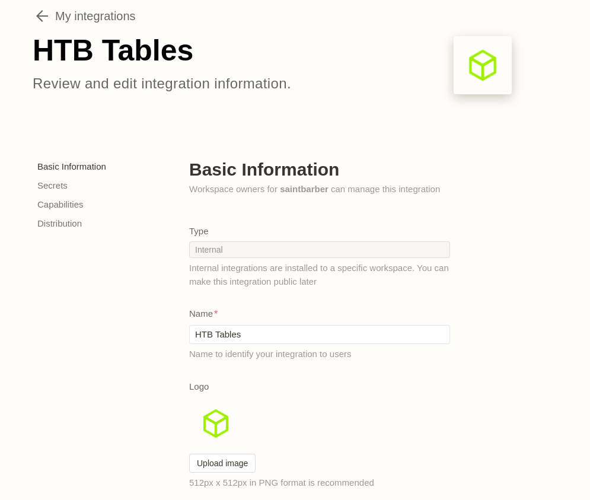
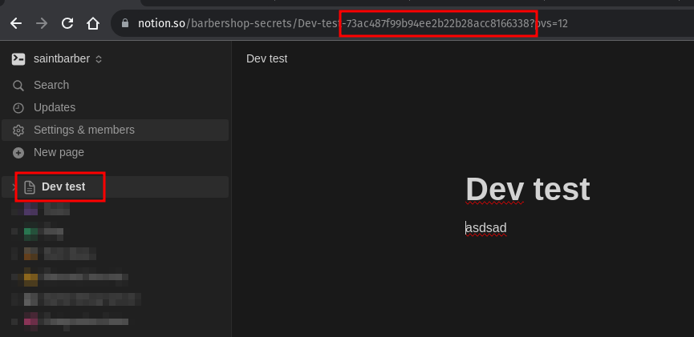
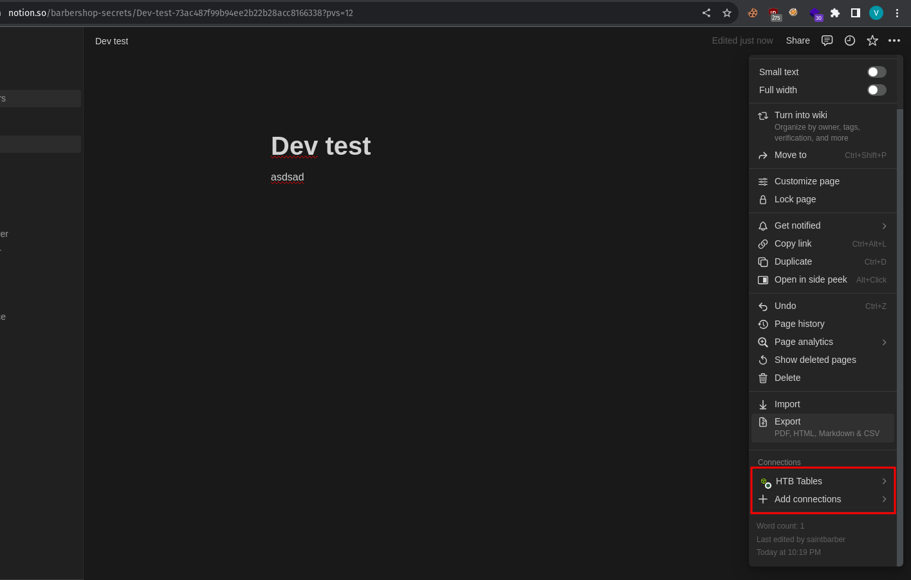
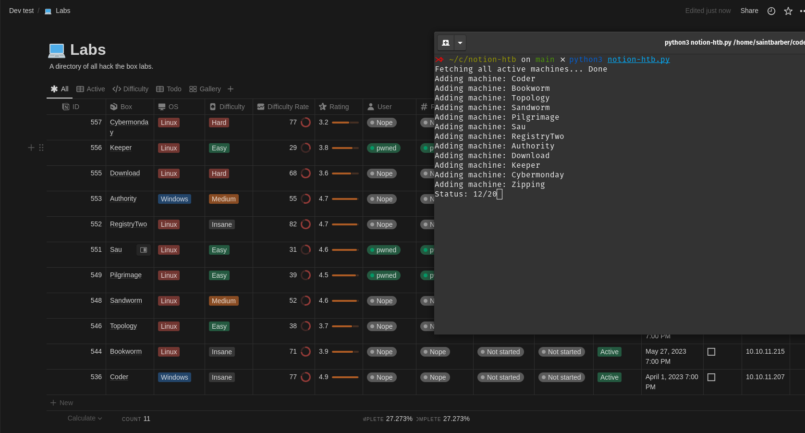

# notion-htb
A simple script to update notion page with HTB challeneges, labs, etc.

### Create Integration

Goto: https://www.notion.so/my-integrations

Click add new integration
Fill out basic info

Go to secrets tab and copy secret

Update `.env` variable `NOTION_API_KEY` with the secret from previous screen.

### Create a page

Open notion and create a page where you want to store the HTB data

Save the ID in the URL, this is the PAGE_ID

Now give access to the integration you created with the page

### Get HTB Token

Go to profile in HTB, then profile settings

Click "Create App Token", give it a name and then copy

### Execute Script - Add boxes

